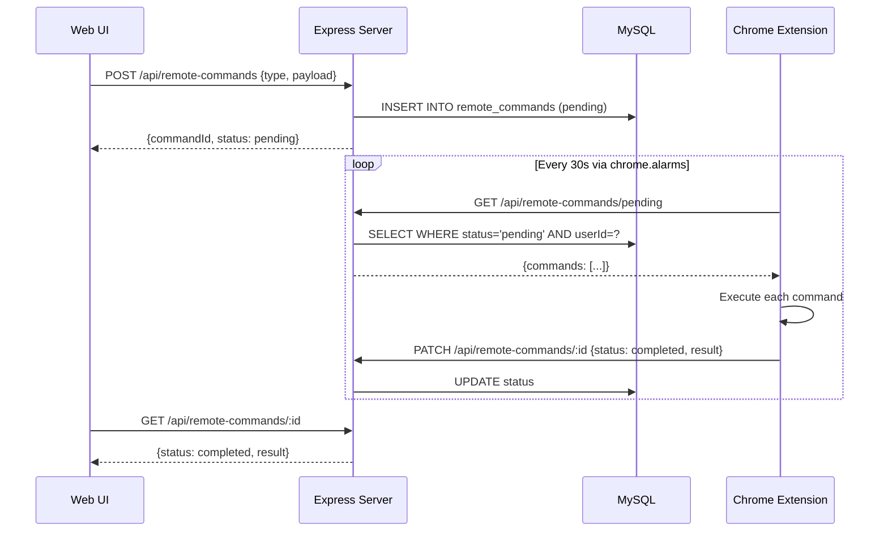
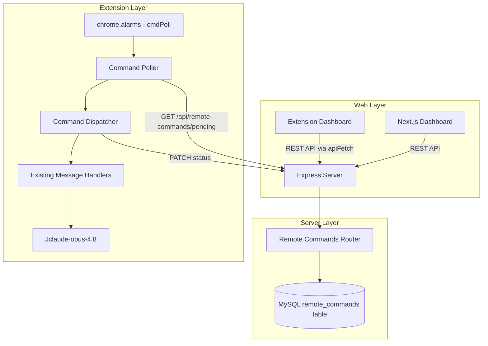

# Remote Control Extension from Web Server

## Goal

Allow users to send commands from the web interface (Next.js app or Express dashboard) to the Chrome extension running on their computer. When the computer is on and Chrome is open with the extension installed and logged in, the extension automatically executes the requested actions — without the user needing to interact with the extension directly.

## Architecture Overview

### Communication Mechanism: Extension-Initiated Polling

Chrome MV3 service workers die after ~30s idle, ruling out persistent WebSocket connections. The most reliable approach within MV3 constraints is **extension-initiated polling** via `chrome.alarms`:



### Why Polling Over Alternatives

| Mechanism | Pros | Cons | Verdict |
|-----------|------|------|---------|
| **Polling via chrome.alarms** | Works with MV3 lifecycle, no new permissions, simple | 30s latency worst case | **Chosen** |
| WebSocket | Real-time | Service worker dies after 30s; can't maintain persistent connection | Not viable |
| SSE via offscreen document | Near real-time | Requires offscreen permission, complex lifecycle, overkill | Overkill |
| Chrome Push Messaging (FCM) | Push-based | Requires FCM setup, GCM project, complex | Too complex for v1 |

### Architecture Diagram



## Detailed Design

### 1. Database Schema — `remote_commands` table

```sql
CREATE TABLE remote_commands (
  id            BIGINT UNSIGNED AUTO_INCREMENT PRIMARY KEY,
  user_id       INT UNSIGNED NOT NULL,
  type          VARCHAR(64)  NOT NULL,    -- command type, e.g. 'create_post', 'crawl_group'
  payload       JSON         NOT NULL,    -- command-specific parameters
  status        ENUM('pending','running','completed','failed','expired') NOT NULL DEFAULT 'pending',
  result        JSON         DEFAULT NULL, -- execution result
  error         TEXT         DEFAULT NULL, -- error message if failed
  created_by    INT UNSIGNED DEFAULT NULL, -- userId of who issued the command (admin or self)
  created_at    DATETIME     NOT NULL DEFAULT CURRENT_TIMESTAMP,
  started_at    DATETIME     DEFAULT NULL,
  completed_at  DATETIME     DEFAULT NULL,
  INDEX idx_pending_user (status, user_id, created_at),
  FOREIGN KEY (user_id) REFERENCES users(id) ON DELETE CASCADE
) ENGINE=InnoDB DEFAULT CHARSET=utf8mb4;
```

**Key design decisions:**
- `status` lifecycle: `pending` → `running` → `completed`/`failed`/`expired`
- `expired` status for commands older than 1 hour that were never picked up (stale)
- `payload` is JSON so each command type can define its own schema
- `created_by` supports admin-initiated commands for other users

### 2. Server-Side API Endpoints

#### POST `/api/remote-commands` — Create a command
```javascript
// Request body
{
  type: "create_post",        // required
  payload: {                  // required, command-specific
    groupId: "123456",
    content: "Hello world",
    images: []
  },
  targetUserId: 5            // optional, admin only — default: self
}

// Response 201
{
  command: {
    id: 1,
    type: "create_post",
    status: "pending",
    createdAt: "2026-06-25T05:30:00Z"
  }
}
```

#### GET `/api/remote-commands/pending` — Poll for pending commands (extension calls this)
```javascript
// Query params: none (userId from JWT token)
// Response 200
{
  commands: [
    {
      id: 1,
      type: "create_post",
      payload: { groupId: "123456", content: "Hello world" },
      createdAt: "2026-06-25T05:30:00Z"
    }
  ]
}
```

#### PATCH `/api/remote-commands/:id` — Update command status (extension calls this)
```javascript
// Request body
{
  status: "completed",   // or "failed", "running"
  result: { ... },       // optional, execution result
  error: "..."           // optional, error message
}

// Response 200
{ ok: true }
```

#### GET `/api/remote-commands` — List all commands (web UI calls this)
```javascript
// Query params: ?status=pending|completed|failed&page=1&limit=20
// Response 200
{
  commands: [...],
  total: 42
}
```

#### GET `/api/remote-commands/:id` — Get single command detail
```javascript
// Response 200
{
  command: {
    id: 1,
    type: "create_post",
    payload: {...},
    status: "completed",
    result: { postUrl: "https://..." },
    createdAt: "...",
    completedAt: "..."
  }
}
```

### 3. Supported Command Types

Each command type maps to an existing extension capability:

| Command Type | Payload Schema | Maps To |
|-------------|----------------|---------|
| `create_post` | `{groupId, content, images?, useAI?, variants?}` | `CREATE_JOBS` → `runJob()` with type "post" |
| `create_comment` | `{postUrl, content, images?}` | `CREATE_JOBS` → `runJob()` with type "comment" |
| `crawl_group` | `{groupId, maxPosts?, groupUrl?}` | `START_CRAWL` → `crawlGroupInTab()` |
| `scan_groups` | `{}` | `SCAN_GROUPS` → `scanJoinedGroups()` |
| `approve_advisory` | `{postId}` | Creates job from advisory |
| `approve_conversation` | `{conversationId, replyContent}` | Creates comment job |
| `delete_post` | `{postUrl}` | `DELETE_POST` → `executeDeletePost()` |

### 4. Extension-Side Changes

#### New file: `src/remote-commands.js`
```javascript
// Polls server for pending commands every alarm tick
// Executes commands by dispatching to existing handlers
// Reports results back to server
```

#### Changes to `src/background.js`
- Add new alarm: `chrome.alarms.create("cmdPoll", { periodInMinutes: 0.5 })` (every 30s)
- Add alarm handler: `else if (a.name === "cmdPoll") pollRemoteCommands()`
- Add message handler: `REMOTE_COMMAND_RESULT` for reporting execution results

#### Changes to `src/api.js`
- No changes needed — `apiFetch()` already handles JWT auth and all HTTP methods

#### Changes to `manifest.json`
- No new permissions needed — already has `alarms`, `storage`, `scripting`, `tabs`, `activeTab`
- Already has host permission for `http://14.225.206.162:3000/*`

### 5. Security Model

1. **Authentication**: Commands are scoped to the authenticated user via JWT. Users can only create/poll commands for themselves (unless admin).
2. **Command type whitelist**: Only pre-approved command types are accepted. Unknown types rejected with 400.
3. **Rate limiting**: Max 10 pending commands per user. Prevents command flooding.
4. **Auto-expiry**: Commands older than 1 hour with status `pending` are auto-expired by the polling function.
5. **No destructive commands without confirmation**: `delete_post` and similar commands require explicit confirmation in the web UI before sending.
6. **Admin role**: Admins can create commands targeting other users (via `targetUserId`).

### 6. Web UI Changes

#### Extension Dashboard (`src/dashboard.html` + `src/dashboard/views/`)
- New view: `remote-commands` — shows command history and status
- Accessible from sidebar navigation
- Displays: command type, status badge, creation time, result

#### Next.js Dashboard (`server/web-ui/`)
- New page: `app/(dashboard)/commands/page.tsx` — remote command interface
- Command creation forms for each type
- Real-time status polling (every 5s via client-side `useEffect`)
- Command history with status filtering

### 7. Offline/Online Handling

- **Extension offline**: Commands remain `pending` in server. Extension picks them up when it comes back online.
- **Extension online but idle**: `cmdPoll` alarm fires every 30s, picks up pending commands.
- **Multiple extensions**: Each user can have one extension at a time. The `cmdPoll` endpoint returns commands only to the polling device. If needed in the future, device_id can be added.
- **Command timeout**: Commands pending for >1 hour are auto-expired. The web UI shows expired status.

## Implementation Steps

### Phase 1: Server-Side Foundation
1. Add `remote_commands` table to MySQL schema (`server/web/schema.js`)
2. Create remote commands router (`server/web/remote-commands.js`)
3. Add API endpoints: POST, GET pending, PATCH status, GET list, GET detail
4. Register router in `server/web/server.js`
5. Test endpoints with curl/Postman

### Phase 2: Extension-Side Polling
1. Create `src/remote-commands.js` — poll function, command dispatcher, result reporter
2. Add `cmdPoll` alarm in `src/background.js`
3. Add `POLL_REMOTE_COMMANDS` message handler for dashboard UI refresh
4. Implement command execution by reusing existing `runJob()`, `crawlGroupInTab()`, etc.
5. Test extension polling locally

### Phase 3: Extension Dashboard UI
1. Add "Remote Commands" view to `src/dashboard.html` sidebar
2. Create `src/dashboard/views/remote-commands.js` — render command list, status, actions
3. Wire up with `bg()` message calls for refreshing command status
4. Test UI in extension popup/dashboard

### Phase 4: Web UI (Next.js)
1. Add TypeScript types for commands (`server/web-ui/src/lib/types.ts`)
2. Add API functions (`server/web-ui/src/lib/api.ts`)
3. Create command page: `server/web-ui/src/app/(dashboard)/commands/page.tsx`
4. Add navigation link in sidebar
5. Test full flow: web UI → server → extension → server → web UI

### Phase 5: Polish & Security
1. Add rate limiting middleware
2. Implement command auto-expiry
3. Add admin command targeting (optional)
4. Add command cancellation endpoint
5. End-to-end testing
6. Extension repackaging
